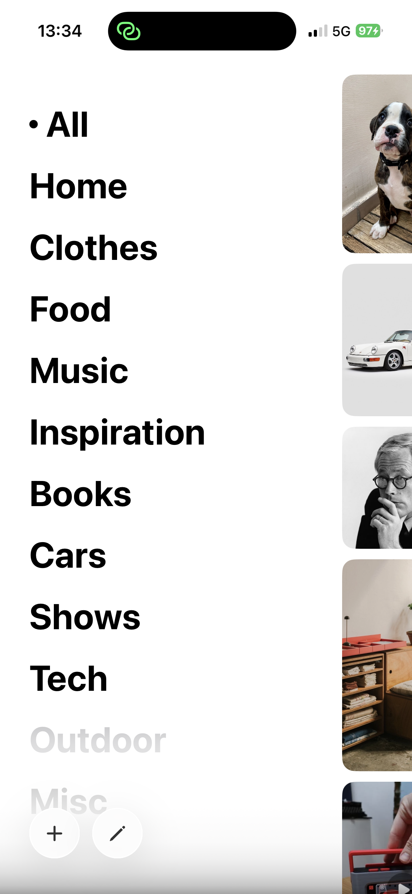

# Pinpin

**Private Moodboard & Bookmarks**

A local-first Pinterest alternative that respects your privacy. Save inspiration, organize your ideas, rediscover what matters. No ads. No algorithm. No account required.

[](https://apps.apple.com/fr/app/pinpin-mobile/id6748907154)

## Screenshots

<p align="center">
  
  
  
  
  
  
</p>

## Features

- **Save anything** — Images, links and text from any app via the Share Extension
- **Pinterest-style layout** — Masonry grid with adaptive columns (2–4 on iPhone, 3–10 on iPad/Mac)
- **Built-in OCR** — Search text inside your saved images, powered by Apple Vision (100% on-device)
- **Visual search** — Find similar products online via Google Lens
- **Offline-first** — Everything stored locally with optional iCloud sync across all your Apple devices
- **Privacy by design** — No tracking, no analytics, no account, no server

## Platforms

| Platform | Minimum Version |
|----------|----------------|
| iOS | 26+ |
| iPadOS | 26+ |
| macOS | 26+ |

## Tech Stack

- **UI:** SwiftUI (100%), custom `Layout` protocol for masonry grid
- **Data:** SwiftData + CloudKit (private database)
- **OCR:** Apple Vision framework (on-device)
- **Architecture:** MVVM + Services
- **Dependencies:** None — pure Apple frameworks

## Building

Open `Pinpin.xcodeproj` in Xcode 16+ and build the desired target:

| Target | Platform | Description |
|--------|----------|-------------|
| `Pinpin` | iOS/iPadOS | Main mobile app |
| `PinpinMac` | macOS | Native Mac app |
| `PinpinShareExtension` | iOS/iPadOS | Share sheet extension |
| `PinpinMacShareExtension` | macOS | Share sheet extension |

> **Note:** You'll need to update the bundle identifier, App Group, and CloudKit container to match your own Apple Developer account.

## Project Structure

```
Pinpin/
├── Shared/              # Cross-platform code (models, services, constants)
│   ├── Models/          # SwiftData models (ContentItem, Category)
│   ├── Services/        # OCR, image optimization, visual search, DB maintenance
│   └── Core/            # Platform type aliases (UIImage ↔ NSImage, etc.)
├── Views/               # iOS/iPadOS SwiftUI views
└── ViewModels/          # iOS state management

PinpinMac/
├── Views/               # macOS-specific SwiftUI views
└── ViewModels/          # macOS state management

PinpinShareExtension/    # iOS share extension
PinpinMacShareExtension/ # macOS share extension
```

## Contributing

This is a personal project. The code is open-source for transparency and learning purposes, but I'm not accepting contributions at this time.

## Privacy

Pinpin is built with privacy as a core principle. Your data stays on your devices and in your private iCloud account. See the full [Privacy Policy](support/PRIVACY.md).

## License

This project is licensed under the [MIT License](LICENSE).

---

*Your inspiration. Your collection. No tracking.*
